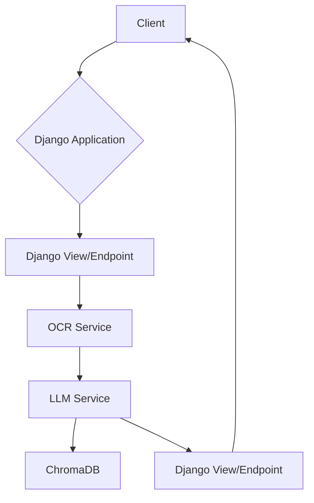

## Project Setup

Each one of the steps described below contains the commands that need to be run in order to complete the configuration step.

1. Navigate to project's root folder

```
$ cd NTD_challenge_OCR
```

2. Create a new virtual environment

```
$ python -m venv .venv
```

3. Install the tesseract OCR globally in your system

```
$ brew install tesseract
```

or if you are using windows check the official documentation on: https://tesseract-ocr.github.io/tessdoc/Installation.html

4. Install project dependencies

```
$ pip install -r requirements.txt
```

<!-- 5. Install transformers for PyTorch

```
$ pip install "transformers[torch]"
``` -->

5. Navigate to Django project folder and run migrations

```
$ cd NTD_challenge_OCR
$ python manage.py migrate
```

6. Authenticate in HuggingFace

For this step you need to head to: https://huggingface.co/mistralai/Mistral-7B-Instruct-v0.1 and click where it says: "Agree and access repository"

The you need to create a token in: https://huggingface.co/settings/tokens and past it after running the following command when it prompts you:

```
$ huggingface-cli login
```

7. Create Django Superuser

```
$ python manage.py createsuperuser
```

You just need to follow the instructions in the shell to assigne a Username and a Password to your user.

8. Run Django server

```
$ python manage.py runserver
```

## Test solution

There are two options available to test the solution.

1. The first one is to run the following command that will allow you to test the solution over the whole dataset:

```
$ cd NTD_challenge_OCR
$ python manage.py process_dataset "/absolute/path/to/dataset"
```

2. The second option will allow you to test the solution on one single document at the time:

   1. Make sure you have the Django server up and running
   2. Open a new terminal
   3. Paste the following command on the terminal you just opened (Make sure to change the path to the document you want to process)

   ```
   $ curl -X POST -F "file=@/absolute/path/to/your/file.jpg" http://localhost:8000/process_document/
   ```

## Architecture Overview

### 1. High-Level Diagram



### 2. System Components

#### a. Frontend / CLI

Command line interface that makes use of Django commands to pass the whole dataset through the pipeline.

#### b. Backend API

Django.

Main route: **process_document/**

#### c. Document Processing Pipeline

- OCR (Tesseract)
- Document classification (mistralai/Mistral-7B-Instruct-v0.1)
- Document entities extraction (mistralai/Mistral-7B-Instruct-v0.1)
- Entities, document type and text storage (ChromaDB)

#### d. Storage Layer

Local instance of ChromaDB.

### 3. Data Flow Example

1. A request to the endpoint **process_document/** is made with a file attached to it.

2. Text is extracted from the file using the OCR technology.

3. Extracted text then is passed through a LLM (Mistral-7B) for zero-shor-classification.

4. After classification relevant entities are extracted from text depending on its type.

5. Then entities, types and text are stored in ChromaDB.

6. The same stored data is structured as JSON and returned to the client.

### 4. Design Choices and Justifications

- Zero-shot-classification: This classification method was selected because is the less expensive method computationally speaking. Other methods that were also considere but did not give great results in comparison with the zero-shot-classification method:

  - Model fine-tunning: After passing the whole dataset through the pipeline the whole traning process took more than 12 hours to complete, making it unfeasible for the given task.
  - Prompting: Creating a custom prompt to pass to the LLM with some short descriptions of the different document types did not archive great results when comparing with the zero-shot-classification method.

- LLM Model (Minstral-7B): Mistral was selected as the model to be used for classification an entities extraction over other models because of the following:

  - Low cost.
  - Ability for prompting.
  - Amount of tokens that can handle.

- OCR Technology (Tesseract): This OCR techonology was selected over others because of the following:
  - Low cost.
  - Ease of configuration.

```

```
